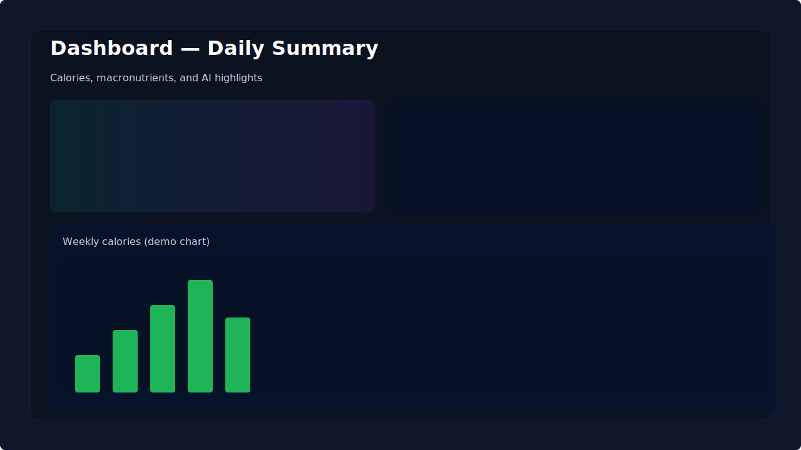

# BioFit AI — Intelligent Health Dashboard

BioFit AI is a modern, polished frontend for tracking nutrition and exercise while delivering AI-powered insights. Built with Vite, React, and Firebase, it blends beautiful data visualizations with intelligent recommendations to help users make informed health choices.

Why BioFit AI?
- Professional analytics: clear charts and daily/weekly summaries.
- Actionable AI: personalized recommendations and scientific-backed tips.
- Fast and responsive: Vite + React for a smooth user experience.
- Secure-by-design guidance: keeps sensitive keys out of source control.

Highlights
- Real-time Firestore syncing for meals & exercises
- Interactive charts (Recharts)
- AI analysis via OpenAI-compatible endpoints (configurable)
- Full bilingual UI (Chinese / English) with centralized i18n

Live demo
- Hosted: https://biofit-e0e49.web.app

Screenshots

<div align="center">
	
	<p style="margin:8px 0; color:#94a3b8">Dashboard — daily summary and charts</p>

	
	<p style="margin:8px 0; color:#94a3b8">AI Weekly Analysis — insights and academic notes</p>

	
	<p style="margin:8px 0; color:#94a3b8">Animated flow: user data → AI engine → recommendation</p>
</div>

Quick Start (Local Development)

1) Clone and install

```powershell
git clone https://github.com/Superior-curtis/BioFitAI.git
cd biofit-dashboard-main
npm ci
```

2) Configure environment (required)

Create a `.env.local` in the project root and add the runtime variables below. NEVER commit this file.

```
VITE_OPENAI_API_KEY=sk-...
VITE_OPENAI_API_URL=https://free.v36.cm/v1
VITE_FIREBASE_API_KEY=...
VITE_FIREBASE_AUTH_DOMAIN=...
VITE_FIREBASE_PROJECT_ID=...
VITE_FIREBASE_STORAGE_BUCKET=...
VITE_FIREBASE_MESSAGING_SENDER_ID=...
VITE_FIREBASE_APP_ID=...
```

3) Run the development server

```powershell
npm run dev
```

Build for production

```powershell
npm run build
```

Deploy Options

1) Firebase Hosting (recommended if you already use Firebase)

```powershell
firebase deploy --only hosting
```

2) GitHub Pages (via GitHub Actions)

This repository includes a GitHub Actions workflow that builds the site and publishes `dist/` to the `gh-pages` branch. To enable it:

- Add the following Secrets under your repository Settings → Secrets → Actions:
	- `VITE_OPENAI_API_KEY`
	- `VITE_OPENAI_API_URL` (optional)
- Push to `main` (or `master`) — the workflow will build and publish automatically.

Pushing your local changes to GitHub

```powershell
git add .
git commit -m "Polished README and deploy workflow"
git push -u origin main
```

Security & Best Practices

- Never check API keys into your repository. Use `.env.local` for development and GitHub Actions Secrets for CI builds.
- Publicly deployed frontend code can expose any embedded key. For production, host the OpenAI key on a secure server or serverless function and proxy AI requests server-side.

Need help? Next steps I can take for you
- Push these updates to your GitHub repository.
- Translate the README into Traditional Chinese.
- Add screenshots, a demo GIF, or deployment badges for a more compelling landing page.
- Provide a small serverless proxy (Firebase Function) example to keep your AI key private.

Contact
- Repo: https://github.com/Superior-curtis/BioFitAI

---
Professional, modern, and ready to showcase. Tell me which extra polish you want (screenshots, Chinese README, or direct push to GitHub) and I’ll do it for you.

---
If you want wording changes to the README (Chinese translation, more screenshots, or deployment badges), tell me what to add and I will update it.
# Welcome to your Lovable project

## Project info

**URL**: https://lovable.dev/projects/46d1fd77-d68e-4eb0-b002-19ff6c819f2d

## How can I edit this code?

There are several ways of editing your application.

**Use Lovable**

Simply visit the [Lovable Project](https://lovable.dev/projects/46d1fd77-d68e-4eb0-b002-19ff6c819f2d) and start prompting.

Changes made via Lovable will be committed automatically to this repo.

**Use your preferred IDE**

If you want to work locally using your own IDE, you can clone this repo and push changes. Pushed changes will also be reflected in Lovable.

The only requirement is having Node.js & npm installed - [install with nvm](https://github.com/nvm-sh/nvm#installing-and-updating)

Follow these steps:

```sh
# Step 1: Clone the repository using the project's Git URL.
git clone <YOUR_GIT_URL>

# Step 2: Navigate to the project directory.
cd <YOUR_PROJECT_NAME>

# Step 3: Install the necessary dependencies.
npm i

# Step 4: Start the development server with auto-reloading and an instant preview.
npm run dev
```

**Edit a file directly in GitHub**

- Navigate to the desired file(s).
- Click the "Edit" button (pencil icon) at the top right of the file view.
- Make your changes and commit the changes.

**Use GitHub Codespaces**

- Navigate to the main page of your repository.
- Click on the "Code" button (green button) near the top right.
- Select the "Codespaces" tab.
- Click on "New codespace" to launch a new Codespace environment.
- Edit files directly within the Codespace and commit and push your changes once you're done.

## What technologies are used for this project?

This project is built with:

- Vite
- TypeScript
- React
- shadcn-ui
- Tailwind CSS

## How can I deploy this project?

Simply open [Lovable](https://lovable.dev/projects/46d1fd77-d68e-4eb0-b002-19ff6c819f2d) and click on Share -> Publish.

## Can I connect a custom domain to my Lovable project?

Yes, you can!

To connect a domain, navigate to Project > Settings > Domains and click Connect Domain.

Read more here: [Setting up a custom domain](https://docs.lovable.dev/features/custom-domain#custom-domain)
